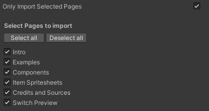

# Unity Figma Bridge


**[WebGL Demo Here](https://simonoliver.itch.io/unity-figma-bridge)** - created with a 1-Click Import
from [this Figma Community file](https://www.figma.com/community/file/1230440663355118588/Figma-Unity-Bridge-Example) or [view live Figma document here](https://www.figma.com/file/DIhmjD8NcAF2UHf69y53fn/Figma-Unity-Bridge-Example?node-id=3%3A1288&t=FojAQsm2ZbnOJL9r-1).

**[Example Unity Project Here](https://github.com/simonoliver/UnityFigmaBridgeExample)** - showing what gets generated
by the tool

Easily bring your Figma Documents, Components, Assets and Prototypes to Unity! This package makes it super simple to
connect a Figma document to your Unity project and import all of your assets as native Unity UI.

It's great for game jamming, quick prototyping and easily bringing your Figma designs into Unity. Tested on Unity
2021.3.X (other versions untested as yet)

**Warning** This is a very early release, so there's a lot that is missing, and probably a lot of bugs - feel free to
send over any PRs or drop me a message on 🐤[Twitter](https://twitter.com/simonoliveruk) or
🐘[Mastodon](https://mastodon.gamedev.place/@simonoliver).

Please note - currently only supports **Unity 2021.3** and later!

## Features

* Supports recreation of core Figma elements as native Unity objects
* Recreate Figma prototype flows to easily build Unity prototypes, including Sections
* SDF renderer for core Figma shapes (Ellipse, Rectangle, Star)
* Recreates Figma components as prefabs and links accordingly (including nested components)
* Responsive layout and support for device safe areas
* Automatically generates required font assets (including downloading missing fonts from Google Fonts)
* Binds Unity MonoBehaviours and fields to Figma objects
* Server side rendering of vector shapes
* Auto layout support (Experimental - may cause issues on complex layouts)
* Scrolling frames (using overflow scrolling settings)

## Setting up


* Open the Package Manager window (Window → Package Manager) and and then select the Add Package icon in the top left of
  the window to add a git package.
* Enter ```https://github.com/simonoliver/UnityFigmaBridge.git```
* Open Project Settings (Edit → Project Settings) and click "Create" to create a new settings asset
* Paste in the URL of your Figma Document (eg ```https://www.figma.com/file/..../...```)
* Get a [Figma Personal Access Token from your user profile page](https://www.figma.com/developers/api#authentication),
  under Settings → Account → Personal Access Tokens
* If you don't already have TextMeshPro in your project, import TMP Essentials (Use Window → Text Mesh Pro → Import TMP
  Essential Resources)

## Prototyping


By default, the importer will recreate the prototype flow found in the Figma File (as defined in the prototype tab). You
can disable this by turning off "Build Prototype Flow" which will just generate Figma assets.

It also supports Figma sections, implementing [Figma's Sections behaviour here](https://help.figma.com/hc/en-us/articles/9771500257687-Organize-your-canvas-with-sections). 
Active screens in each section will be remembered during prototype play.

If *Build Prototype Flow* is selected, it will create required assets (Canvas, ProtoTypeController, EventSystem) and
instantiate the default screen in the active scene. Hit play to start the prototype flow and buttons will transition to
the specified screen as per the Figma document. Currently there is a dew

## Syncing your Figma Document

* Click Figma Bridge → Sync Document
* Enter your Personal Access Token (this will be stored in your Player Prefs for future use)
* It will ask if you want to use the current scene to generate prototype flow - Click yes

## Selecting Figma Pages



If you only want to import specific pages from the Figma document (for example if you use a page for design notes or
brainstorming), you can tick "Select Pages to import" in the settings file. It will then download the document
and show you a list of pages to choose from. This can help speed up import time and reduce the number of
assets imported. Any page that is not selected will have the following rules:

* Components will still be generated (in case they are used on other pages)
* Screens will not be generated
* Image Fills will not be downloaded (unless within a component)
* Server side images will not be rendered (unless within a component)

## How Figma objects map to Unity

| Node Type               | Unity Mapping                                                                                                          |
|-------------------------|------------------------------------------------------------------------------------------------------------------------|
| **Frames**              | Any frame placed on the root of a page is considered a "screen" and turned into prefab, stored in the *Screens* Folder |
| **Image fills**         | These are downloaded as PNGs and imported as sprites and stored in the *ImageFills* folder with the name of Figma ID   |
| **Components**          | Theses are created as prefabs, and stored in the *Components* Folder                                                   |
| **Component Instances** | The matching component prefab is instantiated, and any modified properties are applied                                 |
| **Pages**               | Prefabs of each complete page are stored in the *Pages* folder                                                         |
| **Vectors**             | Rendered on the server as a PNG (see *Server Rendering* nelow)                                                         |

## Fonts

With the goal of trying to make it 1-click sync, if the font doesnt exist in your project it will try and download a
matching TTF font from Google Fonts (
from [Jonathan Neal's google-fonts-complete project](https://github.com/jonathantneal/google-fonts-complete)) and
generate a new TextMesh Pro Font to match.

There are fallbacks to matching fonts if this can't be done

* Do you already have a matching downloaded Google Font in your project?
* If not, is it available to download on Google Fonts (and do you have this enabled)?
* If not, try and find the best match in your project (tries to find matching fonts by name, then best weight match)

To apply shadow and stroke settings, the importer will generate material presets as required.

As a result of the way that TextMeshPro handles outlines, the package will apply a custom shader (Fima/TextMeshPro)
which uses "outside" positioning for strokes (the default in Figma), rather than "center" which TMPro usually uses (in
future we'll support all three positions)

## Color Space

The package supports both Gamma and Linear rendering, but there are some things to bear in mind:
* All used textures must have "sRGB" checked. The importer will automatically do this (as of 1.0.8) but if you are
upgrading from a previous version, you'll need to reimport or do this manually.
* TextMeshPro shaders currently do not render accurately in linear color space. We hope to address this in a future update

## Exporting Assets

* If an object is marked for export, then it will render it as an image, download it as a PNG and place it in the path
  matching the object name. This can include file paths - for example you could name a node "Textures/Icon/GameIcon" and
  it will write the PNG file to "Assets/Textures/Icon/GameIcon.png"

## Server Rendering

When the document is loaded, it will look for nodes that should be rendered on the server. Rendering is done at a scale
set in the settings file (*Server Render Image Scale*, defaults to 3). Currently these are when any of the following are
true:

* An object is a vector shape
* Object is a frame only containing vector shape children nodes
* An object's name contains "render"

If you are seeing a lot of server rendering, check your Figma doc to see how you might be able to optimise (for example
making sure all vectors are in a component so only rendered once)

## Responsive layout

Screens will behave according to constraints setup in the constraints panel, with the exception of "Scale" constraint.
You can use the *SafeArea* component to automatically adjust the safe area for devices that use them (eg iPhone), as
mentioned in *Binding Behaviours*

## Auto layout

Vertical or Horizontal layout groups will be added to mirror the auto layout settings of a given object in the Figma document.
Please note this is disabled by default (enable in settings) as it can cause issues with complex layouts.

## Binding behaviours

As syncing with Figma replaces existing components and screens, the package makes it easy to automatically add
behaviours at sync time, to
prevent you having to manually add them each time you sync.

MonoBehaviours can be automatically bound to components and screens, and methods bound to button clicks. The importer
uses reflection to do the following:


* If a MonoBehaviour exists that matches the name (case insensitive) of the object, it will be attached. Eg if I have a
  frame called "PlayScreen" and a MonoBehaviour called "PlayScreen", then that MonoBehaviour will be added automatically
  at sync time.
* If the attached MonoBehaviour has any serializable fields (public of using SerializeField attribute), they importer
  will try and find matching object names within a depth of 2 (currently hardcoded) and look for a matching component.
  For example, I could add ```public TextMeshPro_UGUI Title``` and if there is a text object called *Title* then it will
  be assigned to that field.


* If you add the ```[[BindFigmaButtonPress("PlayButton")]]``` attribute to a method, then it will add an onClick
  listener to a button with that name (searching within a depth of 2)

Some special case components are automatically added:

* If an object's name contains "Button" or has an activate prototype link then it will add a Button component
* If an object's name is "SafeArea" then it will add a safe area component (useful for phones and other devices with non
  rectangular screens)

If a Button is added, it will look for a child node called "selected". If this is found, it will use this for rollover
state.

## Transitions

The FigmaScreenController can have a TransitionEffect which implements transitions in and out animations. By default a
template fade to black effect is created but can be replaced and assigned.

## Dependencies

These should be imported automatically when the package is added

* TextMeshPro 2.0.1
* JSON.Net 2.01

## Other things

If you need to change your personal access token, use Figma Bridge → Set Personal Access Token

## Credits

Uses:
* [Iniqo Quilez' 2D SDF Functions](https://iquilezles.org/articles/distfunctions2d/)
* [krzy-s UnityWebRequestAwaiter](https://gist.github.com/krzys-h/9062552e33dd7bd7fe4a6c12db109a1a)
* [Jonathan Neal's google-fonts-complete list](https://github.com/jonathantneal/google-fonts-complete)

Big thanks for  making those available online!

## Currently unsupported

* User defined locations for saving assets
* Image tweaks (Exposure, Contrast)
* Blur on shadows
* Ellipse sweep angles and fill ratio
* Most effects (Inner shadow, Layer Blur, Background Blue)
* Multiple fills on a single object
* Stroke styles other than flat colour
* Stroke positions for shapes (outside/center)
* Stroke positions for text (inside/center)
* Dynamic creation of device fonts
* Video Fills
* Star shapes only support five points and non-default radius (missing data from API)
* Star shape only renders at uniform scale
* Polygon Shapes
* Boolean operations
* Line/Arrow
* Consistent UUIDs
* Support for "Scale" constraint

## Feedback, bugs and contributions

Contributions are very welcome! There's a lot that is missing, and probably a lot of bugs - feel free to send over any
PRs or drop me a message on 🐤[Twitter](https://twitter.com/simonoliveruk) or
🐘[Mastodon](https://mastodon.gamedev.place/@simonoliver).